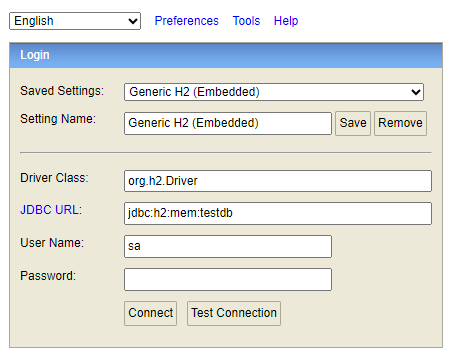
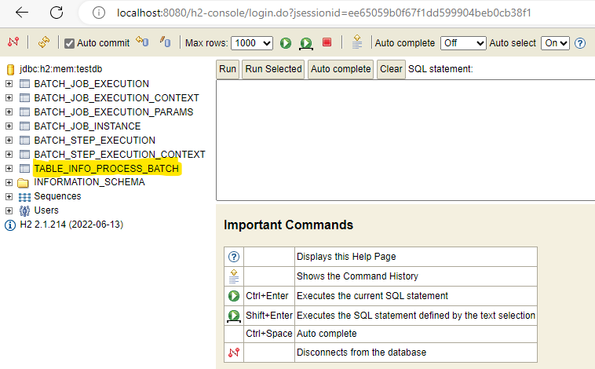
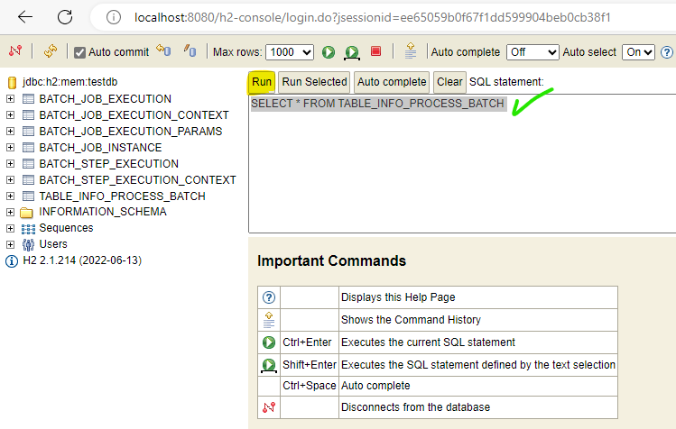

# Batch Cielo Demo

PoC (Proud of Concept) de leitura de arquivo CSV, para gravar as informações em uma tabela usando Spring Batch


## Variáveis de Ambiente

Para rodar esse projeto, precisa de duas variáveis de ambiente.

`PROCESS_FILE_PATH` para definir o path e nome do arquivo que sera processado.

`PROCESS_FILE_HAS_HEADER` para definir se o arquivo possui header


## Rodando localmente

Clone o projeto

```bash
  git clone https://github.com/robinmorin/batch-cielo-demo.git
```

Entre no diretório do projeto

```bash
  cd batch-cielo-demo
```

Execute a seguinte instrução

```bash
  start.cmd fileInfo.csv true
```

A variável de ambiente PROCESS_FILE_PATH será setada com o primer parametro enviado, e variável PROCESS_FILE_HAS_HEADER com o segundo parametro.

Poderá acompanhar o processamento nos logs mostrados na consola.


## Screenshots
http://localhost:8080/h2-console



Quando finalizado o processo, pode executar a consola H2, para conferir os dados gravados na tabela TABLE_INFO_PROCESS_BATCH

Usuario=sa

Senha=<vazio>




No panel, pode clicar na tabela TABLE_INFO_PROCESS_BATCH para executar a query de consulta. As demais tabelas são tabelas de trabalho do proprio Spring Batch.




Execute o Run e deverá se mostrar os 10 registros gravados com os dados que estão no arquivo fileInfo.csv


